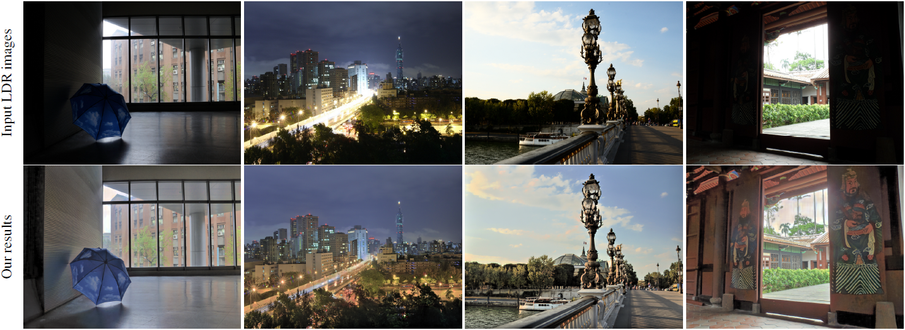
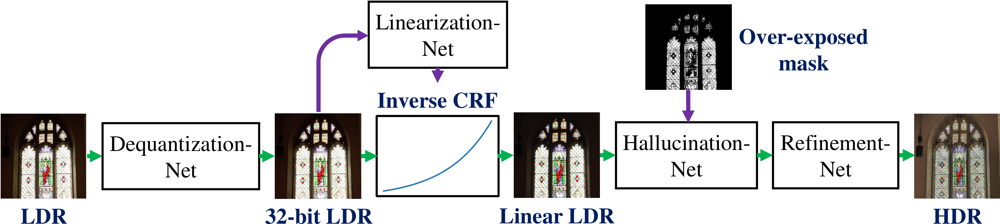

# NW-RSBA
[CVPR 2023] Revisiting Rolling Shutter Bundle Adjustment: Toward Accurate and Fast Solution.



We propose an accurate and fast bundle adjustment (BA) solution that estimates the 6-DoF pose with an independent RS model of the camera and the geometry of the environment based on measurements from a rolling shutter (RS) camera. This tackles the challenges in the existing works, namely, relying on high frame rate video as input, restrictive assumptions on camera motion, readout direction, and poor efficiency. To this end, we first verify the positive influence of normalization to the image point on RSBA. Then we present a novel visual residual covariance model to standardize the reprojection error during BA, which consequently improves the overall accuracy. Finally, we demonstrate the combination of normalization and covariance standardisation weighting in RSBA (**NW-RSBA**) can avoid common planar degeneracy without needing to constrain the filming manner. Besides, we propose an acceleration strategy for **NW-RSBA** based on the sparsity of its Jacobian matrix and Schur complement. The extensive synthetic and real data experiments verify the effectiveness and efficiency of the proposed solution over the state-of-the-art works. The source code, datasets, and pre-trained model are available at our project website.

[Project website](https://delinqu.github.io/NW-RSBA/)

[Paper](https://delinqu.github.io/NW-RSBA)

<a href="https://arxiv.org/abs/2004.01179" rel="Paper"></a>

## Overview
This is the author's reference implementation of the NW-RSBA  described in: "Revisiting Rolling Shutter Bundle Adjustment: Toward Accurate and Fast Solution."
xxx citation and institution...

If you find this code useful for your research, please consider citing the following paper.



## Requirements setup
xxx

## Usage
xxx

## Citation
```bibtex
citation{

}
```

## Acknowledgment
xxx
